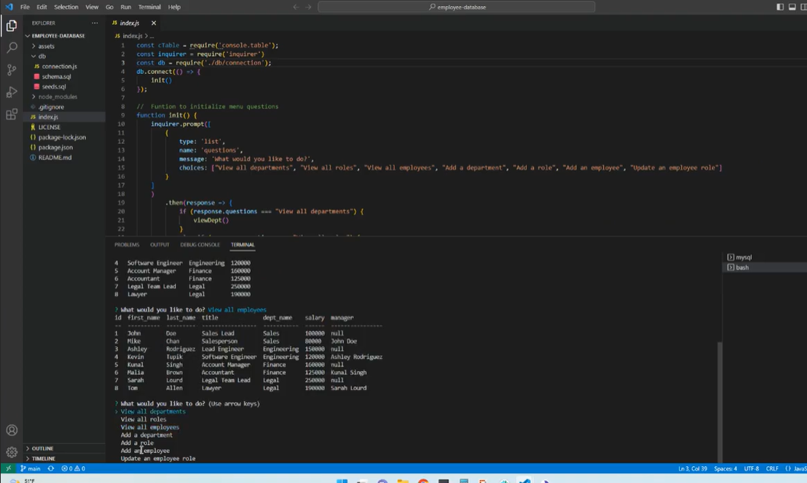

# Employee Database

## Description

This command-line application uses Node.js, Inquirer and MySQL to manage a company's employee database. In this bootcamp project, I learned how to create a content management system that allows users to view and manage a company's departments, roles and employees. 

## Installation Requirements

Node.js, Inquirer 8.2.4, MySql2, console.table

## License

## Screenshot

### Video Link

https://drive.google.com/file/d/1fTQfI0DFtT71mlCxHG-fhEJDpUJV6eC1/view